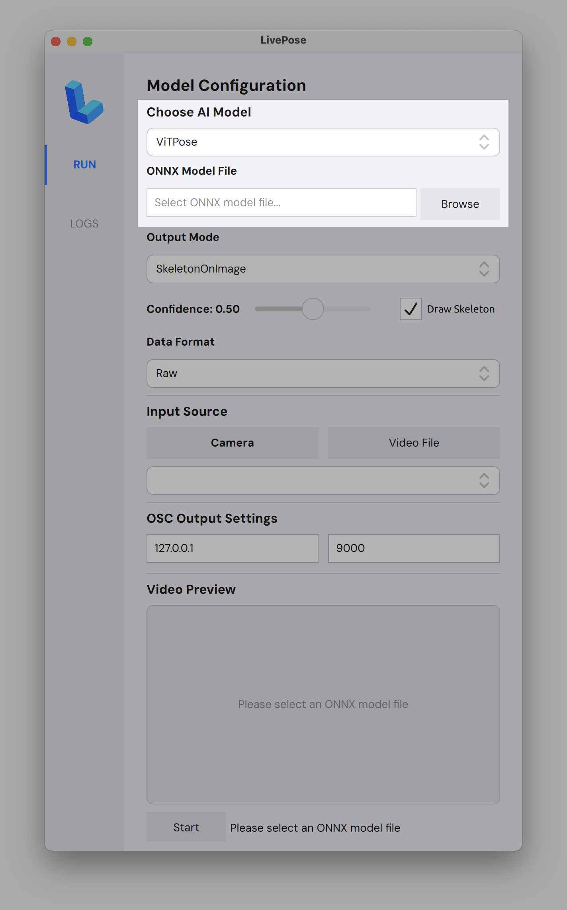
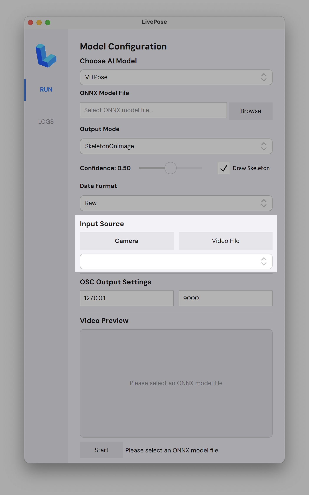
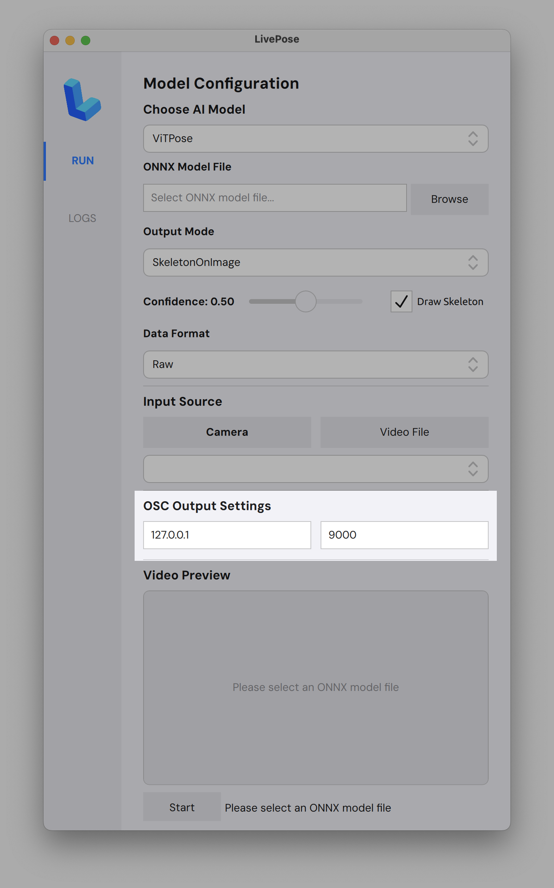

# Usage

LivePose lets you run computer vision models on live video and stream the results over OSC.

## Loading a model

- Click **Browse** next to **ONNX Model File** and select an `.onnx` file
- Models are available from the [model-storage release](https://github.com/sat-mtl/livepose/releases/tag/model-storage)
- Choose your **AI Model** (e.g. ViTPose) and **Output Mode** from the dropdowns
- Adjust the **Confidence** threshold and toggle **Draw Skeleton** as needed

## Camera

- Under **Input Source**, select **Camera** or **Video File**
- LivePose automatically detects connected cameras; pick yours from the dropdown

## OSC output

- Set the **IP** and **port** for your OSC destination (default: `127.0.0.1:9000`)
- Hit **Start**; pose data will be sent in real time
- Use `oscdump` in your terminal for debugging

## Use cases

Connect to **Pure Data**, **Max/MSP**, **Processing**, **p5.js**, **TouchDesigner**, **SuperCollider**, **openFrameworks**, or any OSC-compatible software. Examples coming soon!
